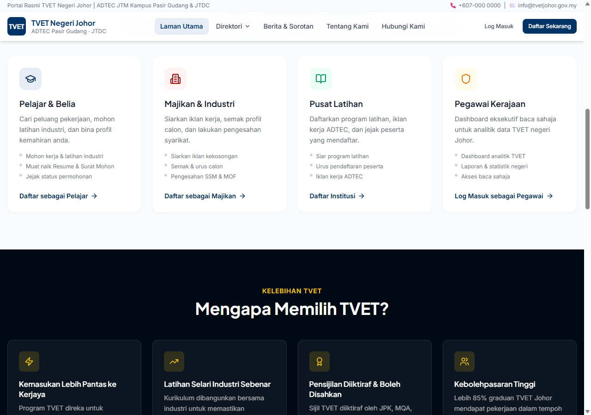
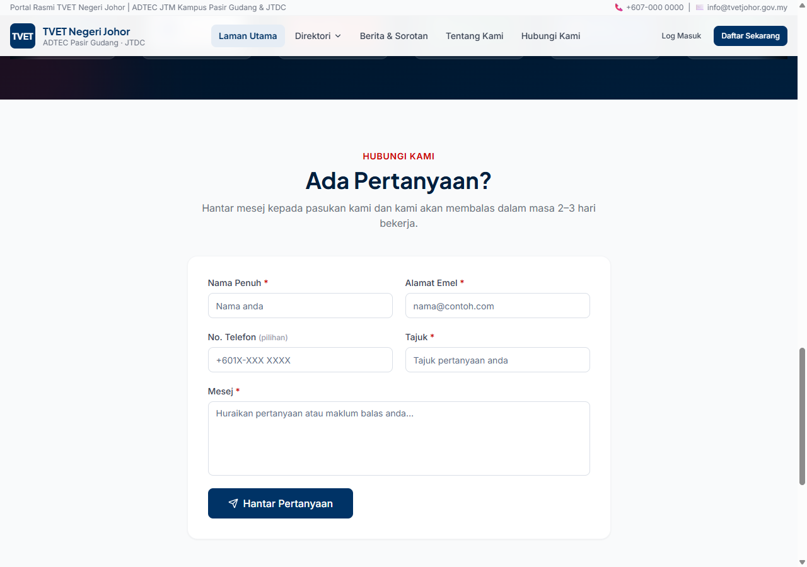
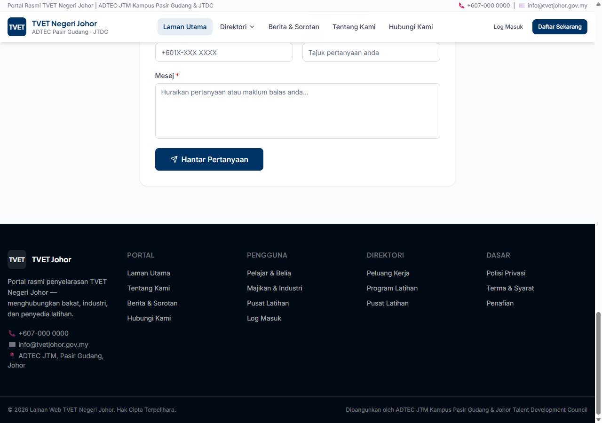
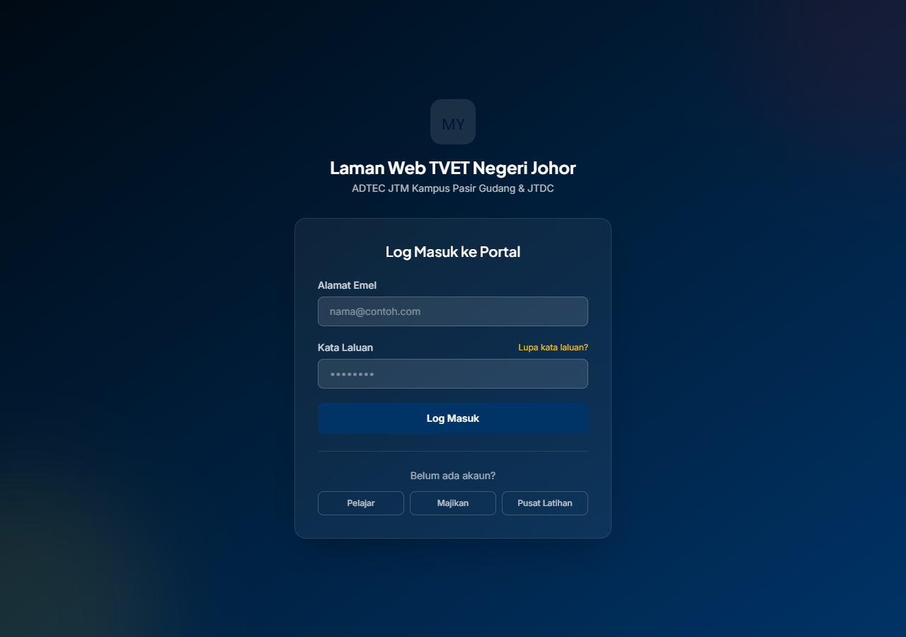
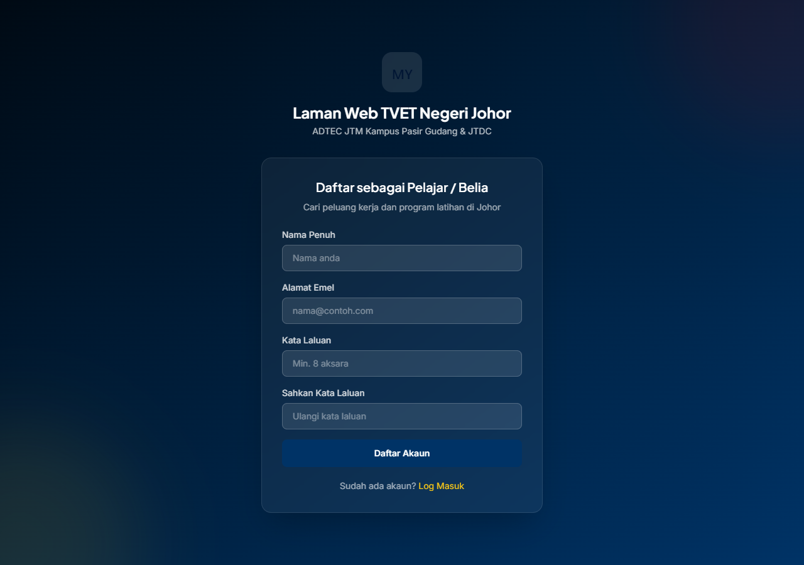
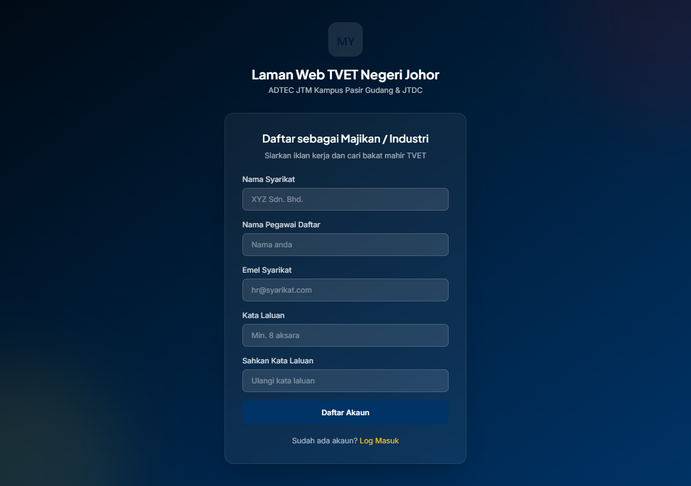
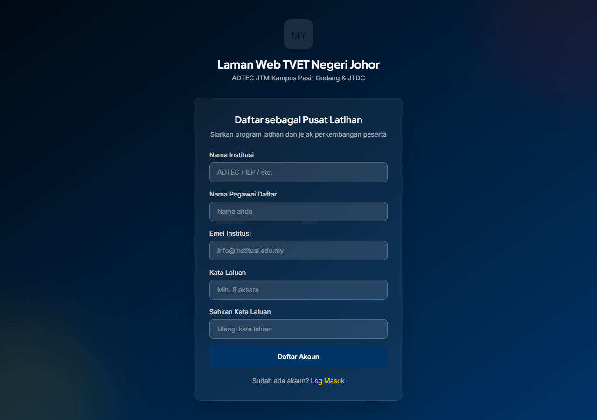
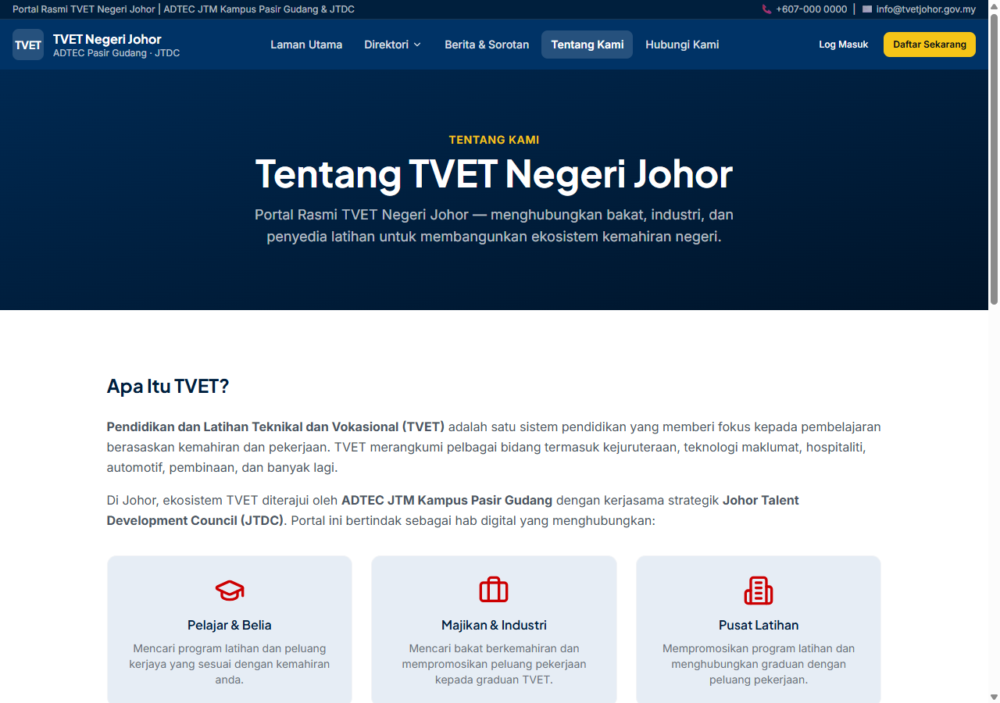
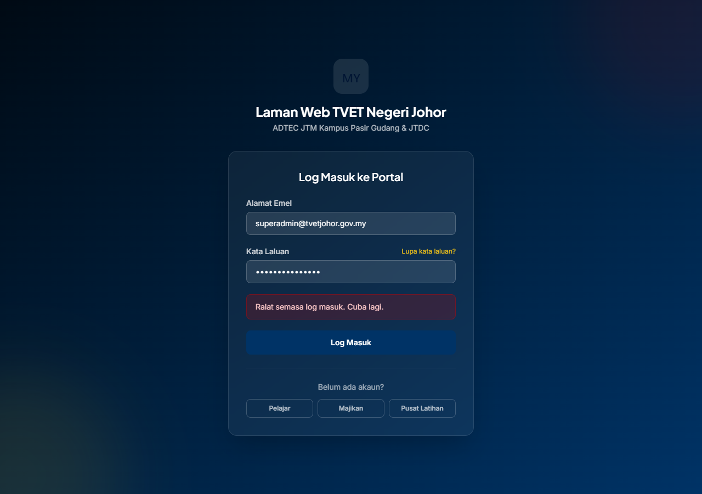
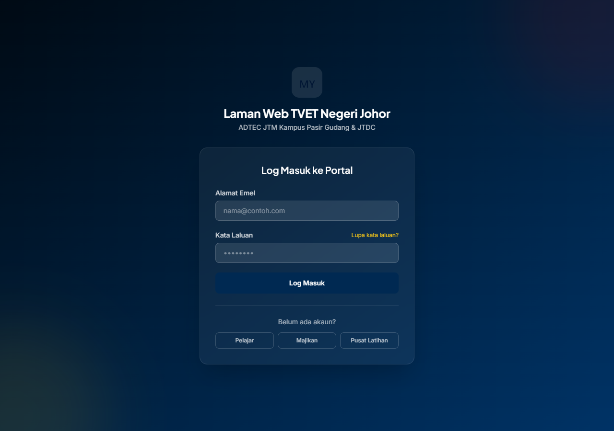

# TVET Johor Portal — Progress Handover Document

> **Prepared for:** JTM / JTDC / ADTEC Stakeholders  
> **Date:** 8 August 2026  
> **Status:** Alpha Preview — Deployed & Functional  

---

## Table of Contents
1. [Overview](#1-overview)
2. [Live Demo](#2-live-demo)
3. [Tech Stack](#3-tech-stack)
4. [Feature Walkthrough](#4-feature-walkthrough)
5. [User Roles & Access](#5-user-roles--access)
6. [Database Schema](#6-database-schema)
7. [Infrastructure & Deployment](#7-infrastructure--deployment)
8. [What's Complete](#8-whats-complete)
9. [What's In Progress](#9-whats-in-progress)
10. [Known Limitations](#10-known-limitations)
11. [Next Steps](#11-next-steps)
12. [Appendix — Admin Credentials](#12-appendix--admin-credentials)

---

## 1. Overview

**TVET Johor Portal** is a comprehensive digital platform for the Johor State TVET ecosystem, connecting students, employers, training providers, and government officials. It is developed by **ADTEC JTM Kampus Pasir Gudang** in collaboration with **Johor Talent Development Council (JTDC)**.

### Key Objectives:
- Centralise TVET job vacancies, training programs, and provider directories
- Enable self-service registration for students, employers, and training providers
- Provide role-based dashboards for all user types
- Streamline document verification and application workflows
- Serve as the official digital hub for Johor TVET

---

## 2. Live Demo

| Environment | URL |
|---|---|
| **Production (Vercel)** | [https://tvet-johor-portal-main.vercel.app](https://tvet-johor-portal-main.vercel.app) |
| **GitHub Repository** | [https://github.com/mesy4/tvet-johor-portal](https://github.com/mesy4/tvet-johor-portal) |

---

## 3. Tech Stack

| Layer | Technology | Purpose |
|---|---|---|
| **Frontend** | Next.js 16 (App Router) + React 19 | Server-side rendering & routing |
| **Language** | TypeScript (strict mode) | Type safety |
| **Styling** | Tailwind CSS 3 + shadcn/ui | Utility-first design system |
| **Backend** | Next.js Server Actions + API Routes | Form handling, auth, uploads |
| **Database** | PostgreSQL 18 (Neon serverless) | Production data store |
| **ORM** | Prisma 6 | Type-safe database queries |
| **Auth** | NextAuth.js (Auth.js) v5 | JWT-based sessions |
| **File Storage** | Supabase Storage / AWS S3 | Document uploads |
| **Email** | Nodemailer (SMTP) | Verification emails |
| **Hosting** | Vercel (Edge + Serverless) | Production deployment |
| **Brand Palette** | Johor Navy (#003366) + Johor Red (#CC0001) | Official state colours |

---

## 4. Feature Walkthrough
# TVET Johor Portal — Progress Handover Document

### 4.1 Homepage - Hero Section

- Full-width immersive background with corporate video
- Dark navy overlay for text readability
- Unified search bar with 3 tabs
- Membangunkan Kemahiran. Memperkasa Johor. tagline in Johor red

### 4.2 Stats & Role Gateway

### 4.3 Why TVET & Rakan Strategik

### 4.4 Contact & Footer

### 4.5 Login

### 4.6 Registration Pages

### 4.8 Tentang Kami

### 4.9 Admin Dashboard

### 4.10 User Management

---

## 5. User Roles & Access

| Role | Dashboard | Capabilities |
|---|---|---|
| SUPERADMIN | /dashboard/admin | Full system access |
| ADMIN_ADTEC | /dashboard/admin | ADTEC-specific admin |
| ADMIN_JTDC | /dashboard/admin | JTDC-specific admin |
| STUDENT | /dashboard/student | Browse jobs, apply, upload resume |
| EMPLOYER | /dashboard/employer | Post vacancies, review applicants |
| PROVIDER | /dashboard/provider | Create programs, post vacancies |
| OFFICIAL | /dashboard/official | Read-only analytics |

---

## 6. Database Schema

| Category | Models |
|---|---|
| Auth | User, Account, Session, VerificationToken |
| Profiles | StudentProfile, EmployerProfile, ProviderProfile, OfficialProfile, AdminProfile |
| Content | Vacancy, Application, TrainingProgram, Enrollment, News, Inquiry |
| Documents | Document (S3/Supabase-backed) |
| Audit | AuditLog, SystemSetting |

25+ tables with full Prisma schema, indexes, and relations.

---

## 7. Infrastructure & Deployment

| Component | Provider | Details |
|---|---|---|
| Hosting | Vercel | Edge + Serverless |
| Database | Neon | PostgreSQL 18, serverless |
| Auth | NextAuth.js | JWT sessions |
| CI/CD | GitHub + Vercel | Auto-deploy on push |

### Vercel Environment Variables
- DATABASE_URL ✅ Set (Neon PostgreSQL)
- DIRECT_URL ✅ Set
- NEXTAUTH_SECRET ✅ Set
- NEXTAUTH_URL ✅ Set
- EMAIL_FROM ✅ Set

---

## 8. What is Complete

- [x] Homepage with video, stats, roles, partners carousel
- [x] Authentication (login + 3 registration flows + email verification)
- [x] Role-based dashboards for all 7 roles
- [x] Admin: dashboard, users, documents, news management
- [x] Public directory pages (kerja, latihan, pusat-latihan)
- [x] News listing & detail pages
- [x] Tentang Kami & Hubungi Kami pages
- [x] Johor brand colours (navy + red)
- [x] Production database (Neon, 25+ tables, seeded)
- [x] Vercel production deployment
- [x] Responsive design (mobile + tablet + desktop)

---

## 9. In Progress / Pending

- [ ] Content population (DB is empty - admins need to create content)
- [ ] Document upload integration (real Supabase/S3 keys)
- [ ] SMTP email (real credentials)
- [ ] Vacancy CRUD forms
- [ ] Training program CRUD forms
- [ ] Application workflow
- [ ] Enrollment system

---

## 10. Known Limitations

1. Video - 41MB PTPK video stored locally only. Host on CDN for production.
2. Partner logos - Current SVG placeholders. Replace with real logos.
3. Email - Console-logging until SMTP configured.
4. Free Neon tier - Good for demo. Upgrade for production.
5. No password reset - Backend pending.
6. Middleware - Simplified to cookie-based auth for Vercel Edge 1MB limit.

---

## 11. Next Steps

### Immediate (Week 1-2)
1. Replace partner logos with actual organisation logos
2. Upload video to CDN and update reference
3. Configure SMTP for real email delivery
4. Create seed content (real jobs, programs, news)

### Short-term (Week 3-4)
5. Vacancy CRUD (admin/employer)
6. Training program CRUD (providers)
7. Password reset flow
8. Document upload integration

### Medium-term (Month 2)
9. Application workflow pipeline
10. Analytics dashboard
11. Notification system

---

## 12. Admin Credentials

| Role | Email | Password |
|---|---|---|
| Superadmin | superadmin@tvetjohor.gov.my | Redacted |
| ADTEC Admin | admin@adtecpg.edu.my | Redacted |
| JTDC Admin | admin@jtdc.johor.gov.my | Redacted |

> WARNING: Change these passwords upon handover.

---

Document prepared by: Mesya | amsyar.zuraidy1999@gmail.com | 8 August 2026
